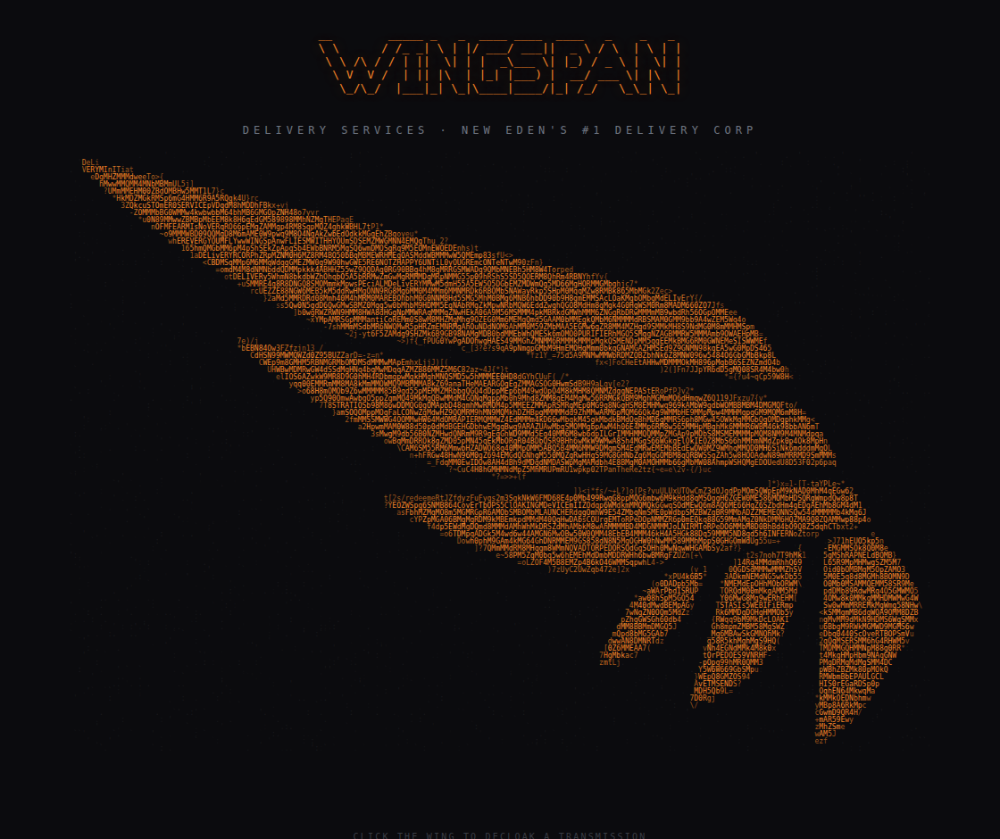
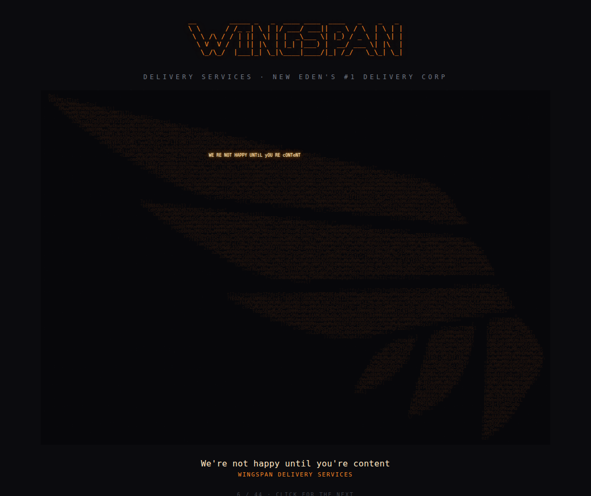

# WINGSPAN — interactive ASCII wing

An interactive ASCII-art rendering of the [WINGSPAN Delivery Services](https://www.torpedodelivery.com/)
wing, made as a re-join artwork submission. The orange wing is "painted" out of
thousands of colour-styled monospace glyphs — and EVE Online phrases are woven
**into** the feathers. Click the wing and it decloaks: the image dims and one
hidden transmission lights up gold, tracing through the wing. Click again for the
next. (Same treatment as the hidden-quote Hypatia portrait it's modelled on.)

**▶ Live:** https://paulclavet.github.io/wingspan-portrait/




## What's hidden in there

44 phrases, woven across the wing and revealed one at a time:

- **WINGSPAN / New Eden catchphrases** — `Delivery Initiated`, `Customer Service V`,
  `The age of fear is over`, `Bombs Away`, `Cloak. Bomb. Deliver.`, `o7`, …
- **Stealthy / cloak-capable ships WINGSPAN flies** — the `Manticore` / `Hound` /
  `Purifier` / `Nemesis` stealth bombers, covert-ops & force-recon hulls
  (`Buzzard`, `Cheetah`, `Helios`, `Anathema`, `Astero`, `Stratios`, `Falcon`,
  `Rapier`, `Arazu`, `Pilgrim`, `Loki`), and Black Ops (`Sin`, `Widow`,
  `Panther`, `Redeemer`).
- **Torpedo / bomb modules & ammo** — `Covert Ops Cloaking Device II`,
  `Bomb Launcher`, the four torpedoes (`Scourge` / `Mjolnir` / `Inferno` / `Nova`),
  `Shrapnel Bomb`, `Void Bomb`, …
- **Covert-ops skills** — `Cloaking V`, `Covert Ops V`, `Torpedoes V`.
- …and `Paul Clavet sends his regards`.

Edit [`phrases.py`](phrases.py) to change them.

## How it works

`index.html` is fully self-contained — no JS frameworks, no network. Each glyph is
a `<span>` coloured to its pixel. The phrase letters are tagged `class="m"
data-q="N"`; a tiny inline script raises and re-colours just the active phrase's
spans while one overlay element dims the rest, so nothing animates ~16k glyphs at
once.

**Hiding the text.** The wing isn't filled with solid blocks — it's a noisy field
of letters/digits/punctuation in mixed case (the same trick as the Hypatia
portrait). A hidden letter is drawn from the same alphabet, cased by the same rule,
and coloured the same as its neighbours, so it's indistinguishable from filler
until it lights up. Hypatia drove the case + glyph weight off the photo's
luminance; a flat logo has none, so here it's driven by the ink coverage plus a
deterministic per-cell hash (`rnd()`), which keeps glyphs of every weight in every
region — nothing about a letter's shape or case betrays it.

## Regenerating

The art is generated from the wing logo by [`generate.py`](generate.py)
(needs [Pillow](https://pypi.org/project/Pillow/); [pyfiglet](https://pypi.org/project/pyfiglet/)
optional, for the header wordmark):

```sh
python3 -m venv .venv && .venv/bin/python -m pip install pillow pyfiglet
.venv/bin/python generate.py            # -> index.html
.venv/bin/python generate.py --cols 240 # finer grid
.venv/bin/python generate.py --preview  # print the plain glyph wing
```

## Credits

The WINGSPAN wing logo is the property of WINGSPAN Delivery Services
(torpedodelivery.com); used here for an in-corp artwork submission. EVE Online and
all ship/module names are trademarks of CCP hf.
